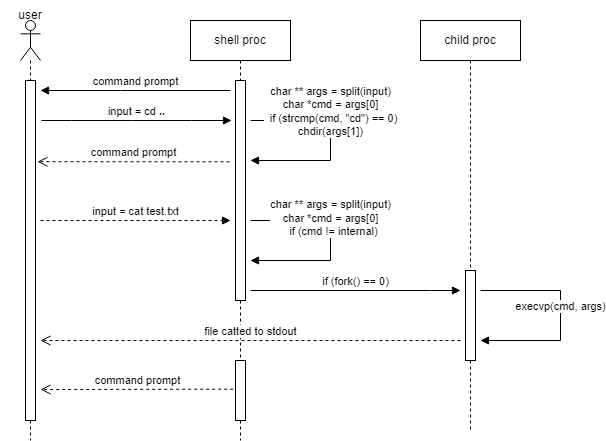
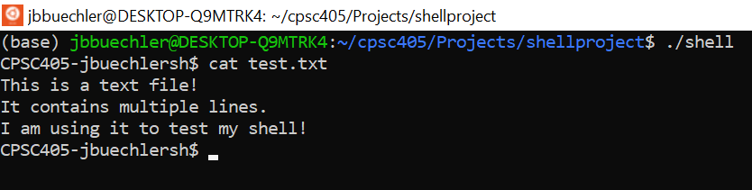
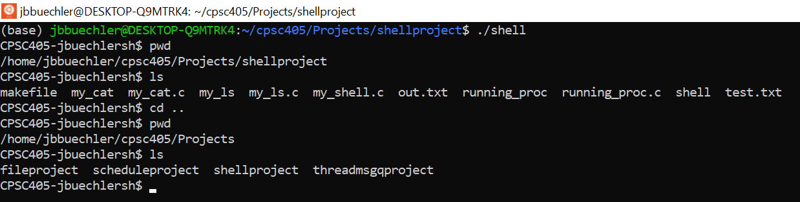
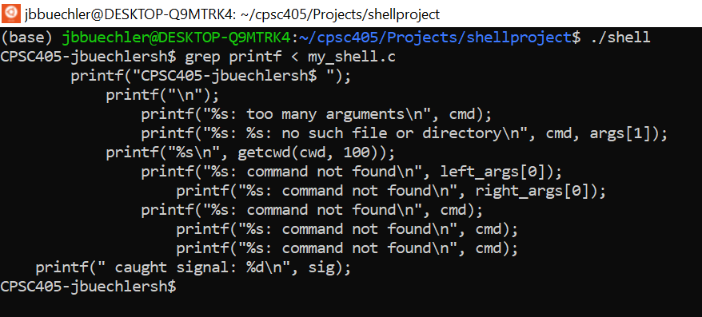
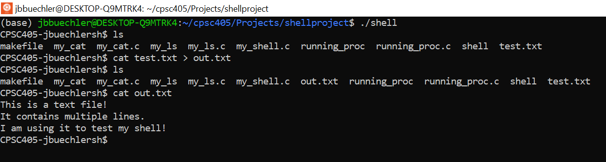
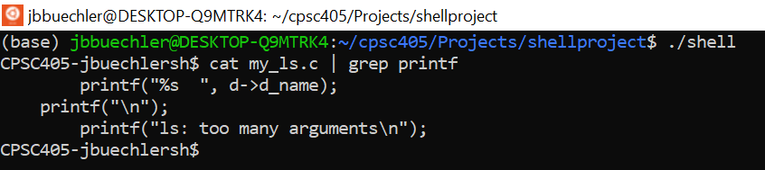
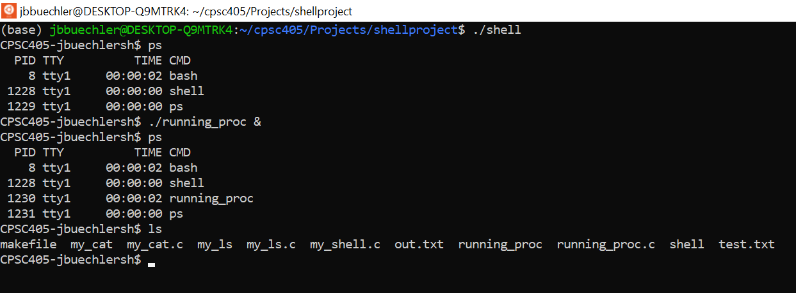
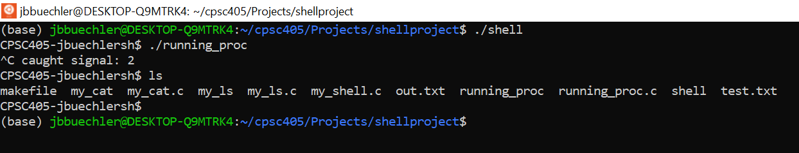
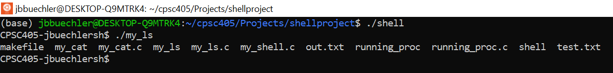
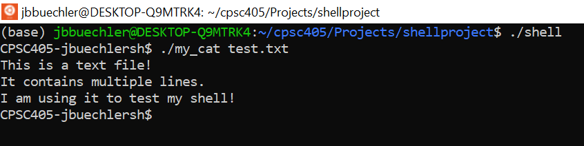

**This repository contains a basic shell program native to Linux operating system
that supports various functionalities, all of which are detailed and demonstrated
in the test cases below!**

**RUNNING**: The exectuable generated by the makefile is named *shell*, type *./shell* to run the program.
**EDITING**: For your changes to be reflected when running the program, the executable must be updated using the makefile. Type *make* before running to ensure all files are up tp date.

**The sequence diagram above describes how the shell functions; a user command is 
first entered and parsed. If the command is internal (defined and supported
by my shell - *cd*/*pwd*/etc), it is simply executed by the shell (parent process). 
If the command is external (undefined by my shell - *grep*/*cat*/etc), the *fork()* system
call is used to duplicate the shell process and create an identical child process. The child
process then makes another system call, *execvp()*, which overwrites the child to execute
the external command.**

**TEST CASES:**

**Execution of basic external command *cat* using *fork()* and *execvp() system calls*.**

**Processing internal commands *cd* (change directory) and *pwd* (print working directory).**

**External command w/ Input redirection (<)** - The grep command's source of input is redirected to *my_shell.c*
file, resulting in a search for all instances of the text "printf" within the specified 
file being printed to the console.

**External command w/ Output redirection (>)** - By default, the cat command prints the contents of a specified file
to STDOUT (console). Instead, the location of output is redirected to a newly created text file, *out.txt*.

**External command w/ Piping (|)** - Piping is used to transfer the output commands; the output of one command will
act as input to another. By default, cat would print all contents of the specified file to the console. Instead,
this output is piped into the subsequent grep command (serving as its input), resulting in all instances
of the text "printf" in *my_ls.c* being printed to the console.

**Background running (&)** - Like an actual Linux shell, processes can be run in the background; while one process is executing, the shell prompt returns to allow the user to continue entering commands.

**Signal handling** - A signal is a software generated interrupt that is sent to a process by the operating system. In the C Standard Library, signal processing/handling defines how a program handles various signals while it executes. This test case demonstrates the handling of two signals generated
by *Ctrl-C* and *Ctrl-D* on the keyboard. The first enables the termination of a running child process without terminating the parent (the shell). The latter enables the termination of the parent process, stopping the shell's execution.

**Local external commands** - The shell's support of external commands includes but is not limited to those defined by linux (*cat*/*grep*/*ls*/etc). The shell can execute any user-written program as a command, so long as the path is provided. This test case demonstrates the execution of my local implementations of the *ls* (*my_ls.c*) and *cat* (*my_cat.c*) commands that are found in the project directory.

